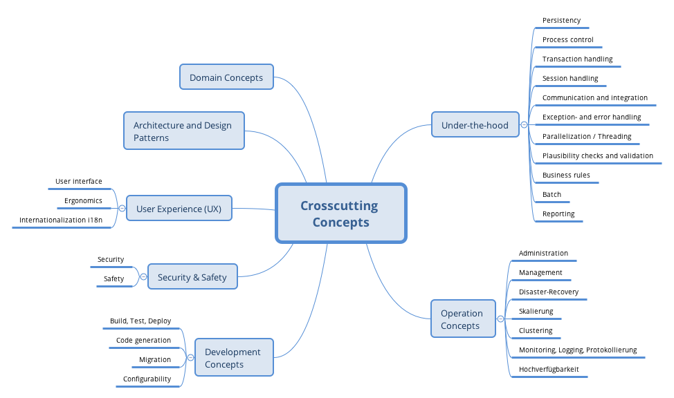
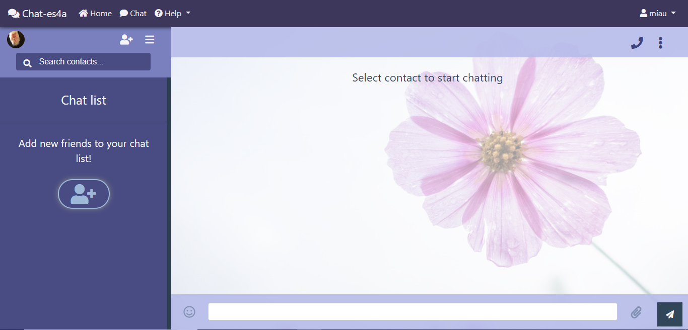

[[section-concepts]]
== Cross-cutting Concepts

=== Domain Model

In th following image, we present you the arquitecture of components we are using in this project. 

image:images/classDiagram.png["Domain Model"]

=== Domain Concept

In our application we have three main domain concepts:

.POD: Place where all client data is store.
.Client: Stakeholder that uses the chat to send and receive messages.
.Message: Text or file sent by client with information for other client.

=== Architecture and design

We are using the architecture design in Angular. It is composed by modules and components following MVC (Model-View-Controller).

==== Modules

This are the main modules that the chat is using to run:

image:images/modules.png["Modules"]

=== User Experience

==== User Interface

Design of the user interface for the app. The user interface is written with Angular 7. We also used Bootstrap templates and the default design from tutorial of SOLID Inrupt website with Angular.
We have pages for the login, main page and chat.

Login:
image:images/login.png["Login Page"]

Home:

Chat:

==== Internationalization

This app will be available in English and we will adapt it to Spanish in the future.

=== Under-the-hood

==== Persistency

The application will be using the costumer POD as database from the SOLID server where the account is hosted. This POD will have all personal data and files and none will be able to administrate it except the owner, the costumer.

==== Exception/Error Handling

Description of how we will handle errors and exceptions. To be filled in the future.

=== Security and Safety

==== Security

All files and data from client will be contained in the POD so the costumer will be the only one who can get it. The chat will be decentralized so it will do it very secure.

==== Safety

This application doesn't have anything dangerous.

=== Development Concepts

==== Testability

In our project we are implementing tests with Cucumbertest y Jasmine.