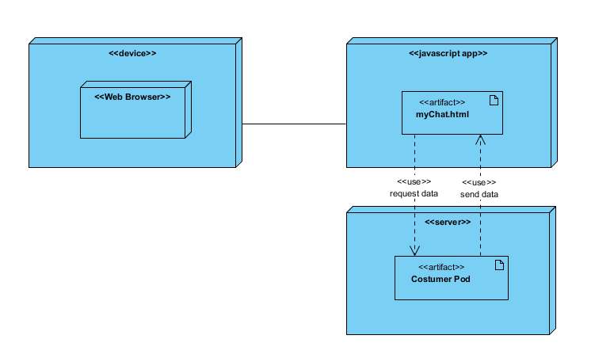

= Deployment View
:lang: en

[[header]]
[[toc]]
[[toctitle]]
Table of Contents

* link:#section-deployment-view[Deployment View]
** link:#infrastructure-level-1[Infrastructure Level 1]
** link:#infrastructure-level-2[Infrastructure Level 2 [TO DO]]

[[content]]
[[section-deployment-view]]
=== link:#section-deployment-view[]Deployment View

==== link:#infrastructure-level-1[]Infrastructure Level 1

[.image]##

Motivation

This is a basic overview of our project. It is basically using a Solid
Pod Server where we have the information and our application will use
this server to get the costumer data. Web Browser allow us to execute
the application and to connect to the server.

Quality and/or Performance Features

SOLID Server will allow us to use our application as decentralized and
the client will be the only one who can administrate his/her own
personal data.

Mapping of Building Blocks to Infrastructure

.Table 1. Deployment nodes and artifact
[width="100%",cols="50%,50%",options="header",]
|===
|Node/Artifact |Description
|myChat.html |Html file that contain all information to execute our
application in the web browser.

|Costumer Pod |This is a place located in a SOLID Pod Server where
costumer can save all personal data.

|Web Browser |A browser that can run our application. Chrome or Firefox
should work.

|SOLID Server |Server where our decentralized app will be build.
|===

[[infrastructure-level-2]]
==== link:#infrastructure-level-2[]Infrastructure Level 2 [TO DO]

Here you can include the internal structure of (some) infrastructure
elements from level 1.

Please copy the structure from level 1 for each selected element.

[[footer]]
[[footer-text]]
Last updated 2019-02-22 09:36:02 CET
